# IBM Data Analyst Professional Certificate:

## Overview:
This certification spans 9 courses that cover spreadsheets, python, jupyterlab, pandas, numpy, seaborn, folium, dash app, sql, sqlite, IBM db2, IBM Watson, IBM Cognos, linear regression, requests, and webscraping to name some of the topics covered and culminates in an all incompassing final project that seeks to utilize most of the skills learn in the 9 courses.

Below is a representation of some of the notes, labs, finals and capstone project for this certification.

Interactive Cognos Dashboard Tab 1
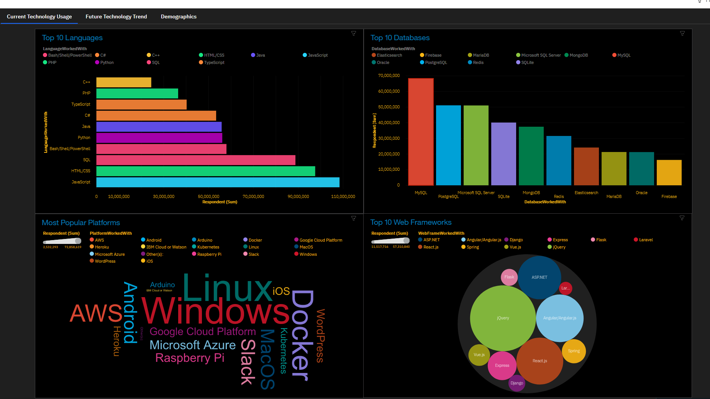

Interactive Cognos Dashboard Tab 2
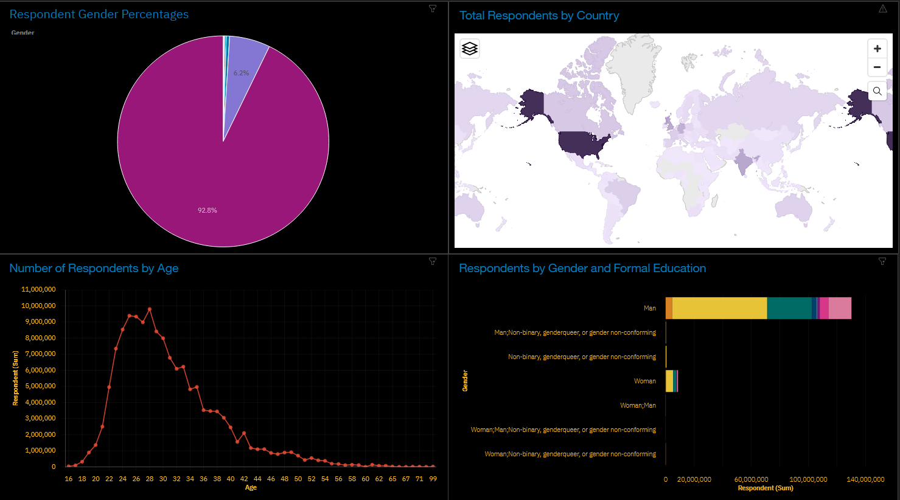

Interactive Cognos Dashbaord Tab 3
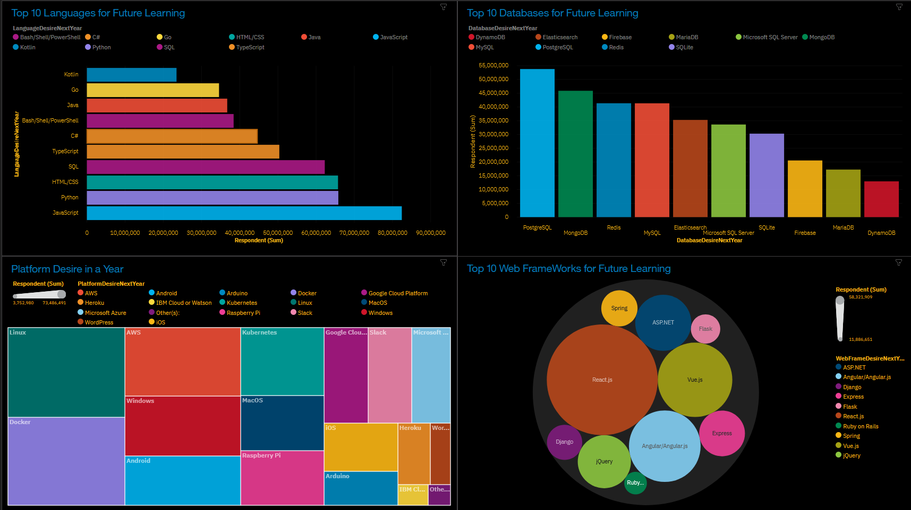

Pie Chart with Python
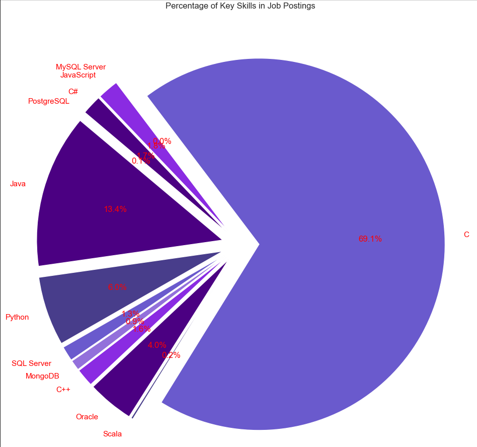

Bar Chart with Python
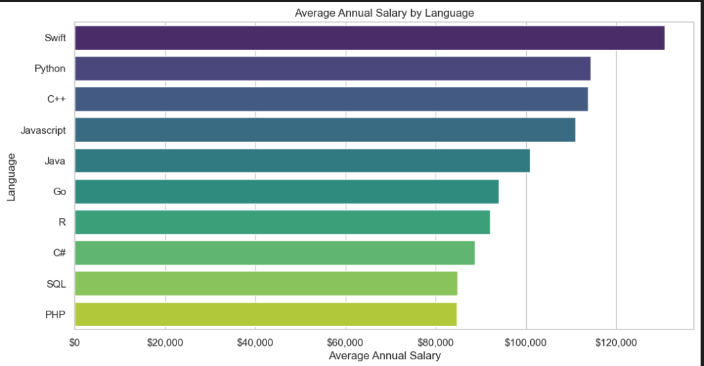

Code Snip for Interactive Dash App:
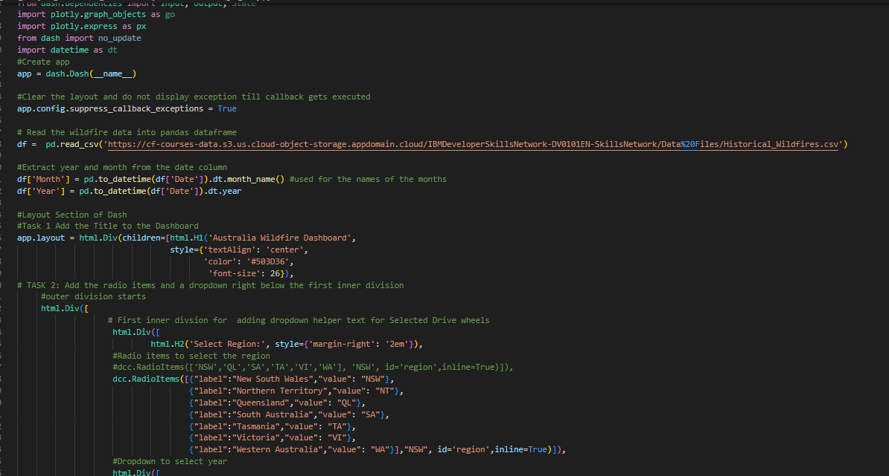

Interactive Dash App Locally Hosted 1
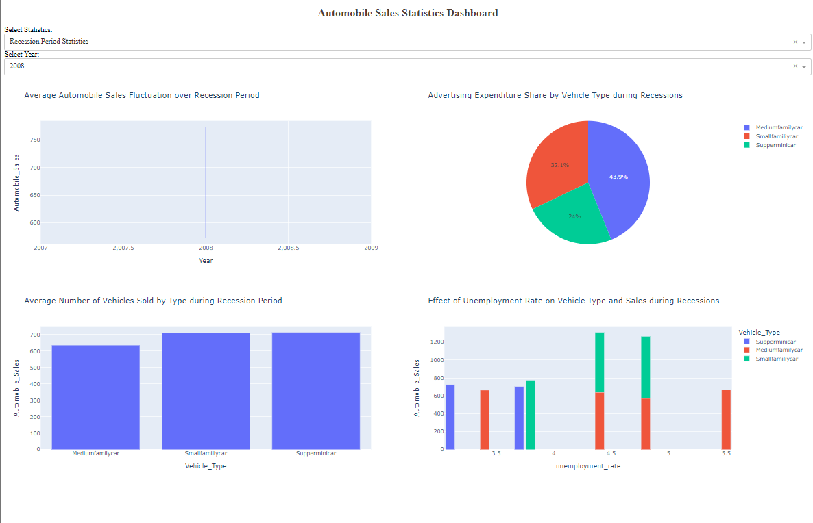

Code Snipe for Interactive Dash App:
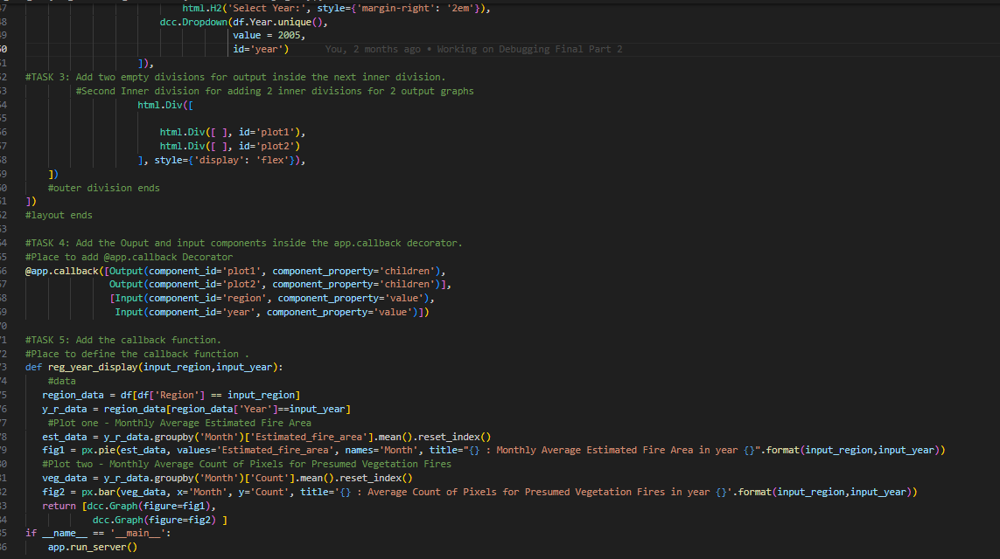

Interactive Dash App Locally Hosted 2
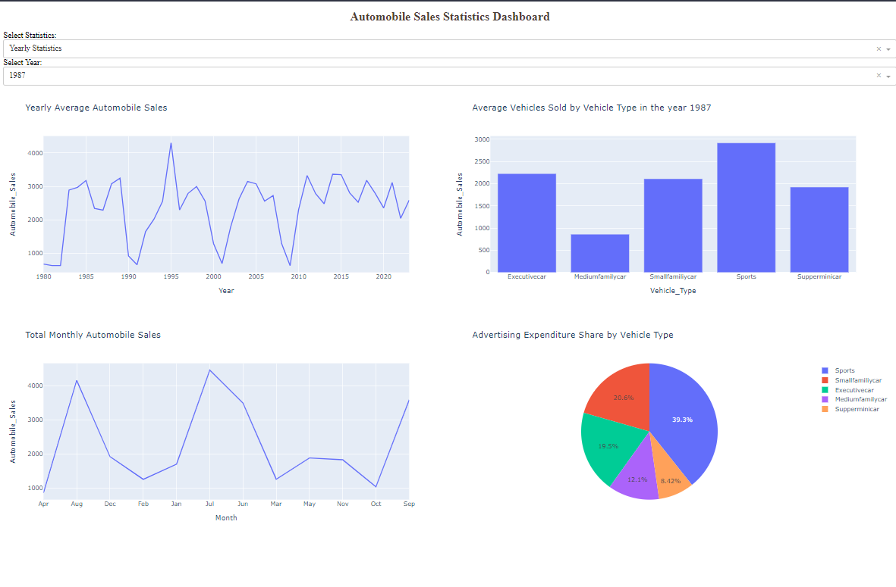

Regression plot with Seaborn
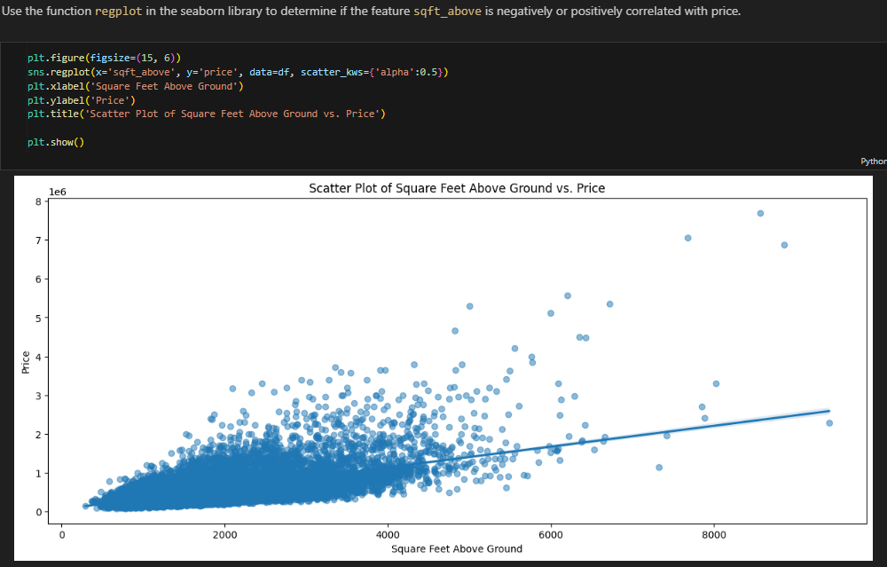

Line Plot with matplotlib
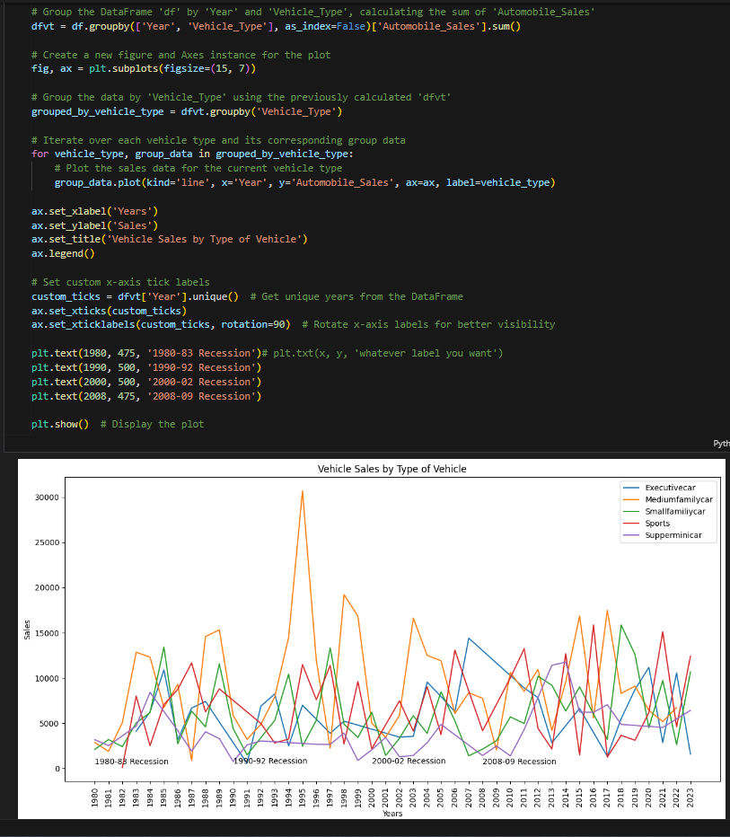

