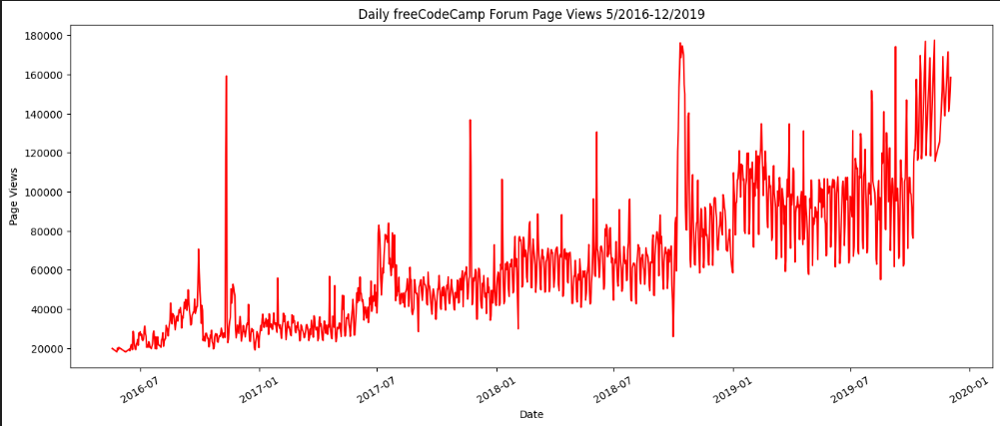
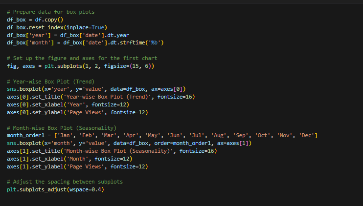
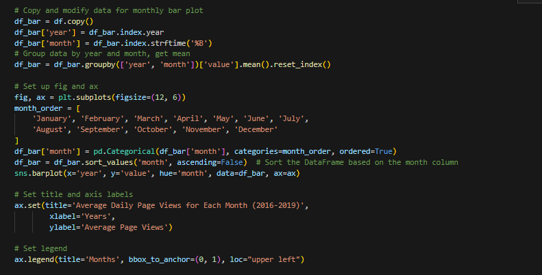

# Data Analysis with Python Certification:

Overview:

 This certification covers concepts such as, reading data from different sources, CSVs, SQL, excel and how to use libraries like Numpy, Pandas, Matplotlib, and Seaborn to process and visualize data. JupyterLab is also covered in the course.

Below are some examples of the Python Visualizations in this certification.

Heatmap with Seaborn:

Linear Regression with Matplotlib and Scipy:

Line Plot with Matplotlib:

Categorical Plot with Seaborn:

Box Plot Code:

Box Plots with Seaborn:

Bar Plot with Seaborn:

