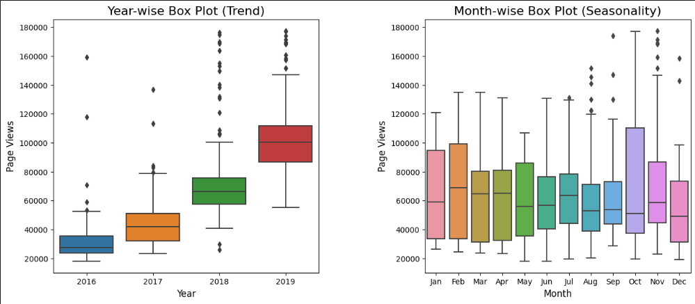

# Data Analysis with Python Certification: freecodecamp.org

Overview:

 This certification covers concepts such as, read data from sources, CSVs, SQL, and how to use libraries like Numpy, Pandas, Matplotlib, and Seaborn to process and visualize data. JupyterLab is also covered in the course.

Below are some examples of the work done in this certification.

Heatmap:

Categorical Plot:

Bar Plot:

Box Plots:

Linear Regression:

