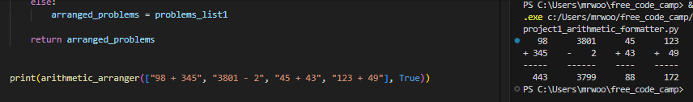
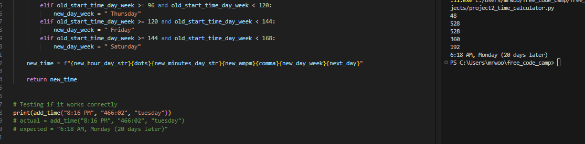
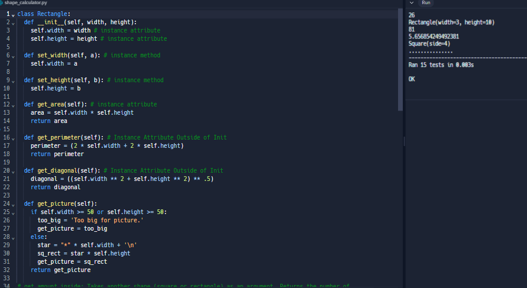
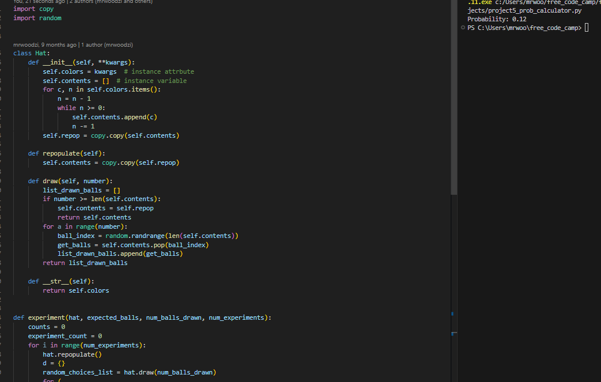

# Scientific Computing with Python Certification

This certification covers Pythonic concepts such as, variables, loops, conditionals, functions and then moves on to complex data structures, networking, relational databases, and data visualization.

Project 1: Arithmetic Formatter

Project 2: Time Calculator

Project 3: Budget App

Project 4: Polygon Area Calculator

Project 5: Probability Calculator

